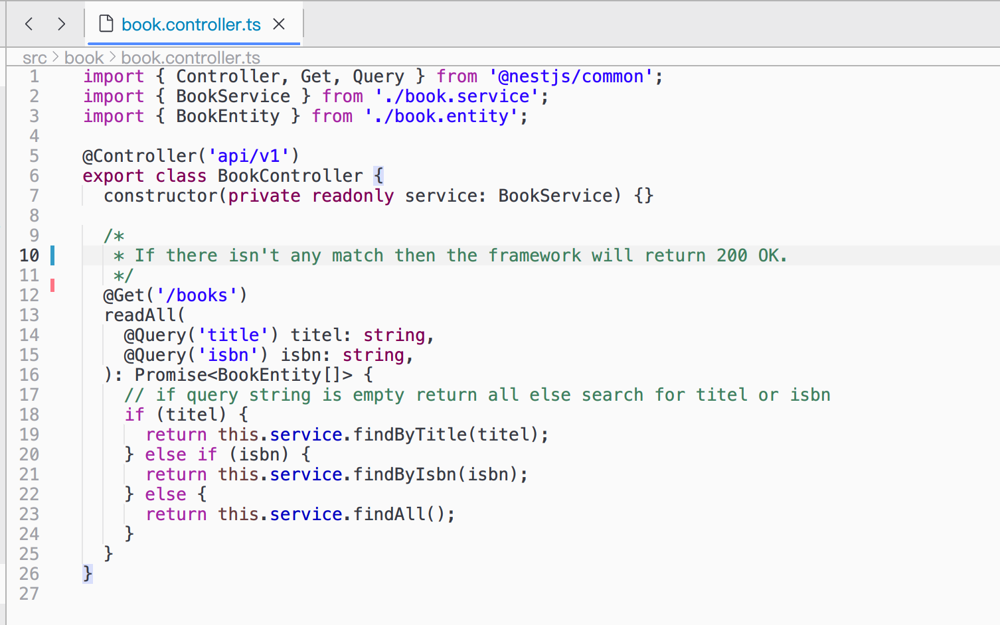

# lapce-eclipse-theme
Theme plugin for Lapce editor to resemble Eclipse Java syntax colors. 

## Install
Install Lapce from https://lapce.dev

Search for the plugin 'Eclipse theme' tab in Lapce. Check out the plugin at https://plugins.lapce.dev/plugins/Lucas3oo/eclipse-theme

## Sample



Set editor font family to 'Menlo'.

## Development and publish the plugin

```console
brew install rust

cargo install volts
```

Then in the plugin folder, run

```console
volts publish
```
